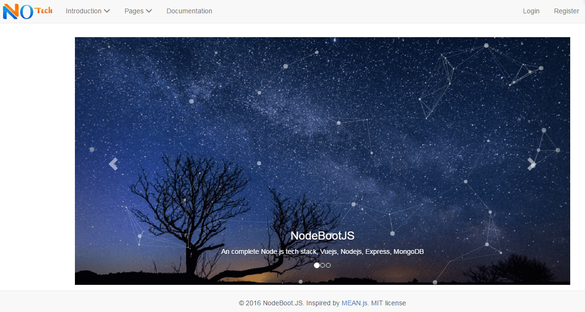
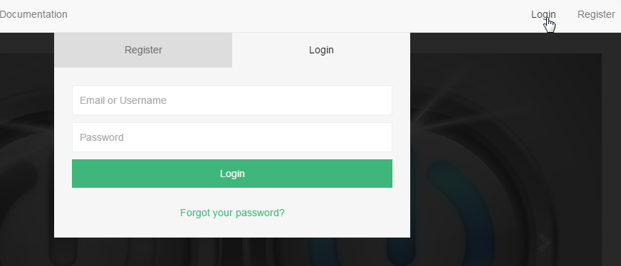
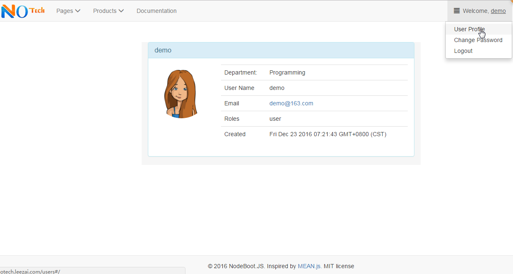
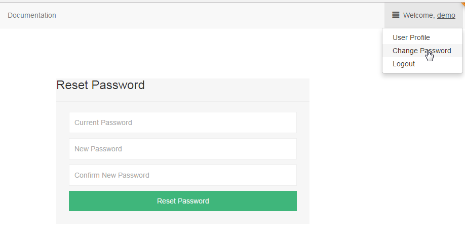
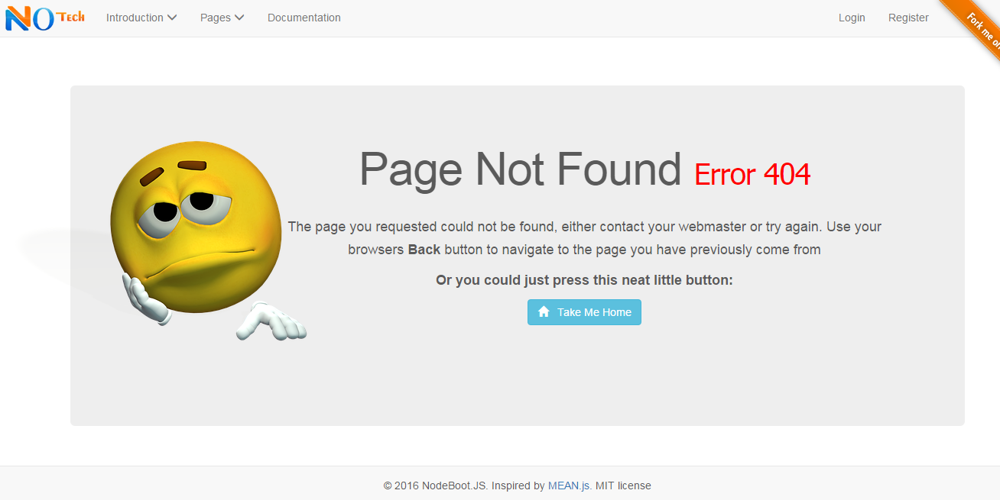

> Well, erm, yes, this is another node starter template (scaffolding project also). This post will try to cover what is NodeBootJS, why NodeBootJS, what does it look like.

## What is NodeBootJS ##

NodeBootJS is an open-source full-stack Javascript solution For Node Application Starter. It aims to help you build an faster, robust, maintainable production web application using Vuejs, ExpressJS, Nodejs and MongoDB.

## Why do I need NodeBootJS ##
<!--more-->
Yeah, let's face the key point you interest in when meet this project. Yes, there is fantastic solution in Javascript ecosystem -- [MEANJS](http://meanjs.org/ "MEAN.JS"). MEANJS shocks and warms me when I met it. It helps us to build application faster with well specification. I become the fans of MEANJS. Highly recommend and promote it during teams. But AngularJS 1.x did stop some newer's step on to MEANJS with its hard learning curve. It may takes you one week, even more(it depends on your experience of MVVM -- Model-View-ViewModel) to get familiar with its rules. Another pain point is AngularJS prefer to build a monolithic SPA (Single Page Application), which may cause the page is heavy on loading.

Months after, I found [VueJS](http://vuejs.org/ "VueJS") during research on MVVM framework for new project. It warms me (sorry that it is the second "warms me" in the post, but it is my feeling at that moment. LOL.). It just takes few hours to start a application with it. For the comparision between AngularJS and VueJS, I leave it to the author [VueJS comparision with AngularJS 1.x](http://vuejs.org/v2/guide/comparison.html#Angular-1) 

I do some research on MEAN.JS like product in VueJS world. But none. So I decide to build one with name "NodeBootJS".

NodeBootJS will help you getting started and avoid useless grunt work and common pitfalls, while keeping your application organized. You just need to focus on the core value of application, and we are behind you for the others.

## What does NodeBootJS look like##

> Just Show Me How to Love You

After long - windedness, it is time to show what does NodeBootJS look like.

Simple steps to clone and run (the steps is [here](https://notechsolution.github.io/2016/12/03/hello-nodebootjs/)). You can access it at http://localhost:8080.

- ##### Home page#####
 Home page is composed by 3 parts: header, content and footer. 

  

Header page has 2 part of menus, left part is dynamic menu from your application config file, while right part is the login / user profile menu.

- ##### Registration & Login#####
  Register,login page and forgot password are embeded in the home page as a modal. It will popup when user click it. 

  User can request password reset email here if forgot password.

  

- ##### User Profile#####
  The right part nav bar at header will change to "User Profile" after login. User can view her/his profile here.

  

  User can change password also.

  
  
   
- ##### Error pages#####
  NodeBootJS already auto handle 404 error if user request an no route url. System will auto redirect to below funny error page.
  

## How many feature does NodeBootJS have##
  > Try best to make NodeBootJS growing all the time, to help more team to fast/easy the development.

NodeBootJS will release v1.0 soon. It will at least include below features;

- ##### Basic Function#####
	- Registration
	- Login
	- Forgot password
	- Change password
	- Home Page
	- Party Menu
	- User Profile
	
- ##### Framework#####
	- Authentication
	- Authorization
	- Session Management
	- Error Handling
	- Graceful shutdown
	- Logging
- ##### Deployment#####
	- Hot reload at development environment
	- Single Page Application package
	- Multiple Single-Page-Application package

## Try it ##
If above feature can meet you requirement, you may have a try the [online demo](http://notech.leezai.com) (http://notech.leezai.com) with account "***demo/Password1!***"